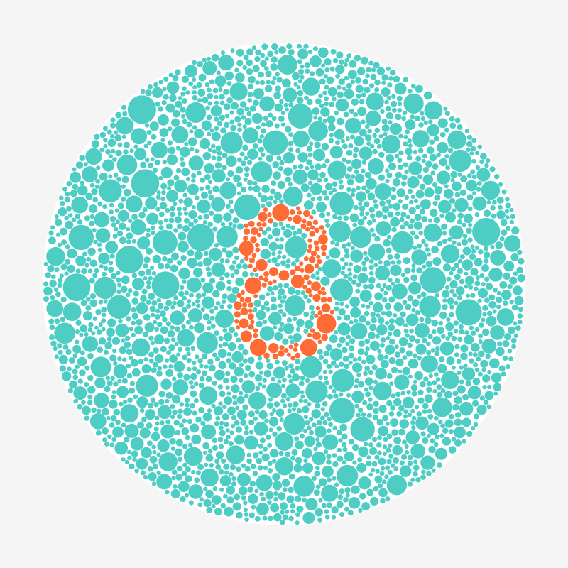

# ColorVision Test Creator

> **⚠️ IMPORTANT MEDICAL DISCLAIMER ⚠️**
> 
> **The images generated by this library are NOT intended for medical diagnosis or clinical use.** These are educational and artistic recreations inspired by color vision testing principles. For actual color vision assessment or medical diagnosis of color blindness, please consult qualified eye care professionals and use medically validated, standardized test materials.
> 
> This software is provided for educational, demonstration, and artistic purposes only.

<div align="center">
  
  
  *Educational color vision test pattern generator inspired by traditional methods*
</div>

Generate educational color vision test images from text input. Create Ishihara-style patterns for educational purposes, accessibility demonstrations, or artistic projects.

## Features

✨ **Text-to-Image Generation** - Create tests from any text input  
🎯 **Professional Quality** - Thousands of precisely placed colored circles  
🔴 **Circular & Rectangular** - Traditional round plates or modern rectangular formats  
📝 **Multi-line Support** - Automatic word splitting for readable layouts  
🎨 **Color Palette Presets** - 11 built-in palettes for different color vision types  
🖼️ **Multiple Formats** - Generate PNG or SVG files  
🔍 **Transparent Backgrounds** - Support for transparent PNG and SVG output  
📏 **Smart Sizing** - Automatic font adjustment to fit within boundaries  
⚙️ **Flexible Options** - Margins, circle sizes, tolerances, and more  
🚀 **Modern Architecture** - Clean, modular codebase with professional structure

## Quick Start

```bash
# Install dependencies
npm install

# Generate a basic test
npx colorvision-test "8"

# Generate circular test with custom colors
npx colorvision-test "42" --circular --on-color "#D2691E" --off-color "#32CD32"

# Use color palette presets for specific color blindness types
npx colorvision-test "8" --palette protanopia --circular

Format Examples:
  colorvision-test "8" --format svg          # Generate SVG output
  colorvision-test "A" --transparent        # PNG with transparent background
  colorvision-test "3" --palette protanopia # Use red-blind test colors

Color Examples:
  Red tones:    #FF6B35, #D2691E, #CD5C5C, #B22222
  Green tones:  #4ECDC4, #88B04B, #6B8E23, #228B22, #32CD32

### Color Palette Presets

The tool includes 11 built-in color palettes optimized for different types of color vision deficiencies:

```bash
# List all available palettes
colorvision-test --list-palettes

# Common palette usage
colorvision-test "8" --palette protanopia     # Red-blind test colors
colorvision-test "5" --palette deuteranopia   # Green-blind test colors  
colorvision-test "3" --palette tritanopia     # Blue-blind test colors
colorvision-test "A" --palette ishihara-classic  # Traditional Ishihara colors
```

**Available Palettes:**
- `default` - Good general contrast for most color vision types
- `protanopia` - Optimized for testing red color blindness
- `deuteranopia` - Optimized for testing green color blindness  
- `tritanopia` - Optimized for testing blue color blindness
- `high-contrast-red` - Maximum contrast red/green combination
- `high-contrast-blue` - Maximum contrast blue/yellow combination
- `subtle-red-green` - Subtle red-green difference for mild deficiencies
- `subtle-brown-green` - Brown-green combination often confused
- `monochrome` - High luminance contrast for monochromacy
- `scientific-red` - Standard red used in color vision research
- `ishihara-classic` - Colors inspired by traditional Ishihara plates

# Programmatic usage
const ColorVisionGenerator = require('colorvision-test-creator');
const generator = new ColorVisionGenerator({ 
  circular: true, 
  palette: 'deuteranopia',
  format: 'svg',
  transparent: true
});
await generator.generate('5', 'output/test.svg');
```

## Contributing

This project is open for contributions! Areas for improvement:
- Additional color palettes optimized for different types of color blindness
- Support for more complex shapes and patterns
- Image export in additional formats (SVG, PDF)
- Web interface for easy online generation
- Batch processing capabilities

## License

MIT License - Feel free to use this project for educational, research, or commercial purposes.

## Important Legal and Medical Disclaimer

**⚠️ NOT FOR MEDICAL USE ⚠️**

The images generated by this software are educational recreations inspired by traditional color vision testing methods. **They are NOT medically validated diagnostic tools and should NEVER be used for:**

- Medical diagnosis of color vision deficiencies
- Clinical assessment of color blindness
- Screening for employment or educational purposes
- Any situation where accurate color vision assessment is required

**For actual color vision testing, please:**
- Consult qualified eye care professionals
- Use medically validated, standardized test materials
- Obtain proper clinical evaluation

This software is provided solely for educational, artistic, and demonstration purposes. The authors assume no responsibility for any medical, legal, or other consequences arising from the use of this software.

## Installation

```bash
# Clone the repository
git clone https://github.com/username/colorvision-test-creator.git
cd colorvision-test-creator

# Install dependencies
npm install

# Make CLI globally available (optional)
npm link
```

## Usage

### Command Line Interface

```bash
# Basic usage
- **CLI usage**: `colorvision-test "8"` → saves to `output/colorvision-8.png`
colorvision-test "A" --output letter-A.png  # Custom filename

# Advanced options  
colorvision-test "42" --size 1000 --font 400     # Large image with big font
colorvision-test "3" --circular --margin 50      # Traditional circular plate with margin
colorvision-test "5" --circular --max-fit        # Maximum text size
colorvision-test "HELLO" --on-color "#D2691E"    # Custom colors

# Get help
colorvision-test --help
```

### CLI Options

```bash
colorvision-test [text] [options]

Options:
  --output, -o     Output filename (default: output/colorvision-[text].png)
  --size, -s       Canvas size in pixels (default: 800)
  --font, -f       Font size (default: 300)
  --min-radius     Minimum circle radius (default: 3)
  --max-radius     Maximum circle radius (default: 20)
  --tolerance      Color mixing tolerance (default: 0.1)
  --on-color       Color for text (default: #FF6B35)
  --off-color      Color for background (default: #4ECDC4)
  --margin, -m     Margin around text in pixels (default: 0)
  --circular, -c   Create circular image like traditional tests
  --max-fit        Use maximum text size in circular mode (less margin)
  --palette, -p    Use predefined color palette
  --format         Output format: png or svg (default: png)
  --transparent    Use transparent background
  --list-palettes  Show available color palettes
  --help, -h       Show help message
```

### Programmatic Usage

```javascript
const ColorVisionGenerator = require('colorvision-test-creator');

// Basic usage
const generator = new ColorVisionGenerator();
await generator.generate('8', 'output/my-test.png');

// With custom options including new features
const customGenerator = new ColorVisionGenerator({
  width: 1000,
  height: 1000,
  circular: true,
  palette: 'protanopia',    // Use color blindness palette
  format: 'svg',            // Generate SVG output
  transparent: true,        // Transparent background
  fontSize: 400,
  margin: 80
});

const result = await customGenerator.generate('42', 'output/custom-test.svg');
console.log(`Generated ${result.circleCount} circles in ${result.outputPath}`);

// Using named imports for utilities
const { TextProcessor, CirclePlacer, CanvasUtils, ColorPalettes } = require('colorvision-test-creator');

// Working with color palettes programmatically
const availablePalettes = ColorPalettes.getPaletteNames();
const protanopiaColors = ColorPalettes.getPalette('protanopia');
```

### Output Formats

The tool supports multiple output formats to suit different use cases:

**PNG Format (Default)**
```bash
colorvision-test "8"                    # Standard PNG with white background
colorvision-test "8" --transparent     # PNG with transparent background
```

**SVG Format (Vector)**
```bash
colorvision-test "8" --format svg      # SVG with white background
colorvision-test "8" --format svg --transparent  # SVG with transparent background
```

**Format Benefits:**
- **PNG**: Raster format, widely supported, good for web and print
- **SVG**: Vector format, infinitely scalable, perfect for high-resolution displays and print
- **Transparent**: Ideal for overlaying on other backgrounds or integration into designs

### NPM Scripts

```bash
npm run cli -- "8" --circular          # Run CLI with arguments
npm run example                         # Run example usage demonstrations
```

## Project Structure

```
colorvision-test-creator/
├── bin/
│   └── colorvision-test          # CLI executable
├── src/
│   ├── colorvision-generator.js  # Main generator class
│   └── utils/
│       ├── canvas-utils.js       # Canvas operations & SVG export
│       ├── circle-placer.js      # Circle placement logic
│       ├── color-palettes.js     # Predefined color palettes
│       ├── luminance.js          # Color calculations
│       └── text-processor.js     # Text rendering
├── examples/
│   ├── basic-usage.js           # Usage examples
│   └── output/                  # Example outputs
├── output/                      # Generated images
├── index.js                     # Main module entry
└── package.json                 # Project configuration
```

### Color Combinations

Popular color combinations that work well for color blindness tests:

**Red/Green variants** (most common):
- `--on-color "#FF6B35" --off-color "#4ECDC4"` (Orange/Cyan)
- `--on-color "#D2691E" --off-color "#6B8E23"` (Saddle Brown/Olive)
- `--on-color "#CD5C5C" --off-color "#228B22"` (Indian Red/Forest Green)

**Alternative combinations**:
- `--on-color "#B22222" --off-color "#32CD32"` (Fire Brick/Lime Green)
- `--on-color "#8B0000" --off-color "#90EE90"` (Dark Red/Light Green)

### Parameters Explained

- **tolerance**: Controls how "pure" each circle must be. Lower values (0.05-0.1) create sharper boundaries but may place fewer circles. Higher values (0.15-0.2) allow more mixed circles but create softer boundaries.

- **minRadius/maxRadius**: Control circle size variety. Smaller circles create more detail but take longer to generate.

- **fontSize**: Controls the size of the text pattern. Larger fonts create bolder, easier-to-see patterns.

- **margin**: Pixels of space around the text area. Default is 0 for full canvas usage. Use larger margins (50-120px) if you want text to stay away from edges. The font size is automatically adjusted to fit within the margin constraints.

- **circular**: Creates round images like traditional Ishihara plates instead of square ones. The circular boundary is automatically calculated based on canvas size and margin. Font size is automatically adjusted to fit within the circular area.

- **maxTextFit**: When used with circular mode, maximizes text size by using 92% of the circle radius for text area (vs 85% in balanced mode). Creates larger, bolder text but with less safety margin from the circle edge.

### Generated Files

The tool creates PNG or SVG files in the `output/` folder with color vision test patterns. Each image contains:
- Hundreds to thousands of colored circles
- Text or numbers visible to people with normal color vision  
- Text becomes difficult/impossible to see for people with specific types of color blindness
- Optional transparent backgrounds for flexible integration
- Vector SVG format for infinite scalability

### Dependencies

- `canvas`: For image generation and text rendering
- `fs`: For file writing (built-in Node.js module)

## API Documentation

### ColorVisionGenerator Class

```javascript
const generator = new ColorVisionGenerator(options);
```

**Options:**
- `width` (number): Canvas width in pixels (default: 800)
- `height` (number): Canvas height in pixels (default: 800)  
- `fontSize` (number): Font size in pixels (default: 300)
- `minRadius` (number): Minimum circle radius (default: 3)
- `maxRadius` (number): Maximum circle radius (default: 20)
- `tolerance` (number): Color mixing tolerance (default: 0.1)
- `onColor` (string): Text color hex code (default: '#FF6B35')
- `offColor` (string): Background color hex code (default: '#4ECDC4')
- `margin` (number): Margin around text in pixels (default: 0)
- `circular` (boolean): Create circular image (default: false)
- `maxTextFit` (boolean): Use maximum text size in circular mode (default: false)
- `palette` (string): Color palette name to use (default: null)
- `format` (string): Output format 'png' or 'svg' (default: 'png')
- `transparent` (boolean): Use transparent background (default: false)

**Methods:**
- `generate(text, outputPath)`: Generate color vision test image
  - Returns: `{ outputPath, circleCount }`

### ColorPalettes Utility

```javascript
const { ColorPalettes } = require('colorvision-test-creator');
```

**Methods:**
- `getPaletteNames()`: Get array of all available palette names
- `getPalette(name)`: Get palette object by name
- `getAllPalettes()`: Get all palettes as object
- `isValidPalette(name)`: Check if palette name exists
- `getPaletteHelpText()`: Get formatted help text for CLI

## Requirements

- **Node.js**: Version 14 or higher
- **Canvas**: Native dependencies (automatically handled by npm install)
- **Platform Support**: macOS, Linux, Windows (with build tools)

## Output Organization

All generated images are automatically saved to the `output/` folder to keep your project directory clean:

- **CLI usage**: `colorvision-test "8"` → saves to `output/colorvision-8.png`
- **Custom filename**: `colorvision-test "A" --output my-test.png` → saves to `output/my-test.png` 
- **Full path**: You can still specify full paths like `./custom/subfolder/test.png`

The `output/` folder is automatically created if it doesn't exist, and it's ignored by git to prevent committing generated images.

## Examples & Demos

Run the included examples to see different generation techniques:

```bash
npm run example                    # Run all example generations
node examples/basic-usage.js       # Programmatic usage examples
```

This will generate sample images showing:
- Basic number tests (`basic-8.png`)
- Circular plates with custom colors (`circular-3.png`) 
- Multi-character text handling (`multi-42.png`)
- Maximum text fitting (`maxfit-A.png`)
- Fine-tuned parameters (`finetuned-7.png`)

### Visual Examples Gallery

| Style | Command | Result |
|-------|---------|---------|
| **Basic Rectangular** | `colorvision-test "8"` | Full canvas rectangular format |
| **Traditional Circular** | `colorvision-test "3" --circular` | Full canvas circular plate |
| **With Margin** | `colorvision-test "5" --margin 50` | Add space around text |
| **Color Palette** | `colorvision-test "A" --palette protanopia` | Red-blind optimized colors |
| **SVG Vector** | `colorvision-test "5" --format svg` | Scalable vector format |
| **Transparent Background** | `colorvision-test "8" --transparent` | PNG with transparent background |
| **SVG + Transparent** | `colorvision-test "3" --format svg --transparent` | Vector with transparent background |
| **Multi-character** | `colorvision-test "42"` | Automatic multi-character layout |

## Tips for Best Results

1. **Simple text works best**: Single digits (0-9) or letters (A-Z) produce the clearest results
2. **Multi-word text**: Automatically splits into multiple lines - "HELLO WORLD" becomes two lines
3. **Contrast matters**: Use colors with good luminance contrast for better visibility
4. **Font size auto-adjustment**: System automatically fits text within margins and boundaries
5. **Margin planning**: Larger margins ensure better text visibility but may reduce font size for longer text
6. **Test tolerance**: Lower tolerance values (0.05-0.1) create sharper, more defined patterns
7. **Circular vs rectangular**: Circular images look more authentic but may fit fewer circles
8. **Be patient**: Generation can take 30-60 seconds for complex patterns with thousands of circles